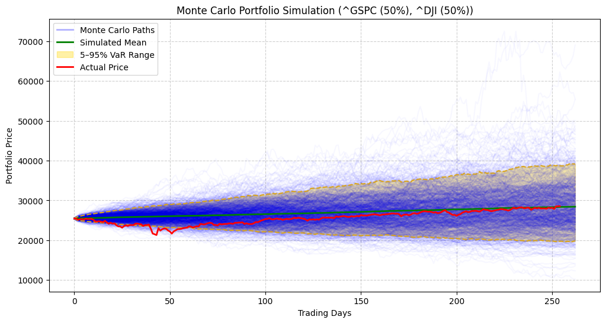
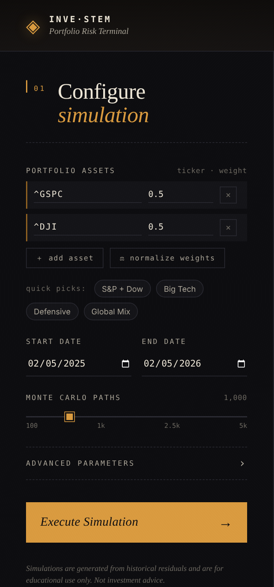
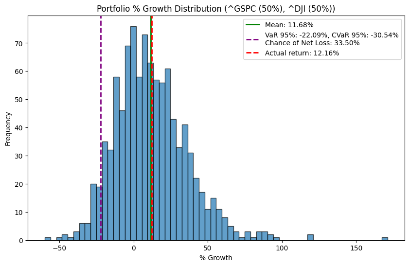

# inve-STEM — Multi-Asset Monte Carlo Portfolio Simulation

A Python-based framework to simulate multi-asset portfolio price paths using **Monte Carlo simulations with GARCH(1,1) volatility and Student-t shocks**.
It allows modeling fat-tailed shocks, correlated residuals, and visualizing portfolio risk metrics versus actual historical performance.



*Test case: 50% S&P 500 (^GSPC) and 50% Dow Jones (^DJI), 5 Feb 2025 to 5 Feb 2026, 1,000 paths. The red line is what the portfolio actually did.*

The project ships in two forms:

1. **The original script** — `simulation.py`, runnable standalone using IDLE. Also available as Jupyter notebook.
2. **The web frontend** — a Flask-based browser UI that wraps the original script unchanged, so non-technical users can pick tickers, tweak parameters, and view results without touching code.

---

## Features

- **Multi-Asset Support**: Simulate portfolios with any number of assets and configurable weights.
- **GARCH Volatility Modeling**: Capture time-varying volatility with GARCH(1,1) models.
- **Fat-Tailed Shocks**: Use Student-t distributions to model extreme market events.
- **Correlated Assets**: Estimate residual correlations and simulate correlated paths.
- **SQLite Database Integration**: Store and retrieve historical stock prices efficiently.
- **Monte Carlo Simulation**: Generate thousands of stochastic portfolio paths.
- **Risk Metrics**: Compute 5–95% VaR bands, Conditional VaR (CVaR), chance of net loss, and growth distributions.
- **Visualization**: Plot portfolio paths, mean trajectory, VaR bands, and terminal return distributions.
- **Web Frontend**: Browser-based UI to configure and run simulations without editing code.

---

## Main zip file structure

```
Quant-MC-InveSTEM--main/
├── simulation.py       # Core simulation engine (original, unmodified)
├── app.py              # Flask server — imports simulation.py and serves the web UI
├── requirements.txt    # Python dependencies
├── templates/
│   └── index.html      # Web UI markup
└── static/
    ├── style.css       # Web UI styling
    └── app.js          # Web UI client logic
```

---

## Install dependencies

Install via pip by running the following line in terminal:

```bash
pip3 install -r requirements.txt
```

Or, if you only want to run the standalone script:

```bash
pip3 install numpy pandas matplotlib yfinance scipy arch numba
```

If you also want the web frontend, add Flask:

```bash
pip3 install flask
```

---

## Option A — Run the standalone script

Download and run `simulation.py`:

```bash
python3 simulation.py
```

This uses the `CONFIG` block at the top of the script to run the simulation and opens matplotlib windows with the plots.

### Configuration

Define your simulation parameters inside `simulation.py`:

```python
CONFIG = {
    "tickers": ["^GSPC", "^DJI"],      # Portfolio asset tickers
    "weights": [0.5, 0.5],             # Portfolio weights
    "start_date": "2025-02-05",        # Simulation start date (yyyy/mm/dd)
    "end_date": "2026-02-05",          # Simulation end date   (yyyy/mm/dd)
    "paths": 1000,                      # Number of Monte Carlo paths
    "df_tails": 15,                     # Student-t degrees of freedom
    "vol_window": 30,                   # Rolling window for initial volatility
    "max_daily_return": None,           # Optional cap on daily returns
    "return_type": "simple",            # "log" or "simple"
    "db_file": "stocks.db"              # SQLite database
}
```

---

## Option B — Run the web frontend

The web frontend gives anyone a point-and-click interface to the simulator — no Python editing required.

### Start the server

From the project directory, run:

```bash
python3 app.py
```

Then open **http://127.0.0.1:5000** in your browser.

<p align="center"></p>

### How to use the UI

1. **Add tickers and weights** in the Portfolio Assets list, or click a quick-pick preset (S&P + Dow, Big Tech, Defensive, Global Mix).
2. **Set the start and end dates** for the simulation window.
3. **Choose how many Monte Carlo paths** to run. More paths = smoother distribution, slower run.
4. **Optionally open Advanced parameters** to adjust `df_tails`, `vol_window`, return type, and max daily return.
5. Click **Execute Simulation**. The results — metric strip (Mean, VaR 95%, CVaR 95%, P(loss), best/worst, actual return) and the two charts — appear in the right panel.

### How it works

`app.py` imports `simulation.py` as a module and calls its `download_and_store(...)` and `PortfolioSimulator(...).simulate()` functions directly. The simulation code itself is untouched; the Flask layer only handles the form input, dispatches the simulation call, and renders the matplotlib output as PNGs in the browser.

If you edit `simulation.py`, restart `app.py` to pick up the changes. The first run takes a little longer because `numba` JIT-compiles the GARCH loop.

---

## Monte Carlo Portfolio Plot Elements and Results Description



*Same test case. Simulated mean return 11.68% against an actual return of 12.16%, with a 5% VaR of -22.09% and a 33.5% chance of ending at a loss.*

1. **Monte Carlo Paths (Blue, faint lines)**
   - Each thin blue line represents one simulated portfolio path over the trading period.
   - Generated using GARCH-based volatility and correlated asset returns.
   - Shows the range of possible portfolio outcomes under the stochastic model.

2. **Simulated Mean (Green line)**
   - Represents the average value of all Monte Carlo paths at each trading day.
   - Expected portfolio trajectory.

3. **5–95% Value-at-Risk (VaR) Band (Gold shaded area)**
   - Covers the 5th to 95th percentile of simulated paths.
   - Represents the central 90% range of possible outcomes, showing portfolio uncertainty.
   - Helps visualize the likely range of portfolio values.

4. **5% and 95% VaR Lines (Gold dashed lines)**
   - Lower dashed line: 5% quantile, representing downside extreme scenarios.
   - Upper dashed line: 95% quantile, representing the upside extreme.

5. **Actual Portfolio Prices (Red line)**
   - Shows the real historical portfolio values, calculated from actual market data.
   - Useful for comparing model predictions with actual performance.

6. **Terminal Return Distribution (Histogram in Growth Distribution Plot)**
   - Displays the distribution of final portfolio returns across all Monte Carlo paths.
   - Helps assess probabilities of gains, losses, and extreme outcomes.

7. **Mean Terminal Return (Vertical Green Line in Histogram)**
   - Marks the average final return across all simulations.
   - Serves as the expected final outcome.

8. **5% VaR and 5% CVaR (Vertical Purple Lines in Histogram)**
   - 5% VaR: worst 5% outcomes.
   - 5% CVaR: average of the worst 5% outcomes, highlighting extreme downside risk.

9. **Probability of Loss (Calculated Metric)**
   - Percentage of paths ending below the initial portfolio value.
   - Not plotted directly, but key for risk assessment.

---

## Test case

`inveSTEM Test case 50% ^GSPC 50% ^DJI.ipynb` shows a test case from 2025-02-05 to 2026-02-05 for a portfolio comprised of 50% ^GSPC and 50% ^DJI.

---

## Known issues

Slight mismatch between the total number of actual and simulated days as the simulation does not take weekday holidays into account; similar minor issues may arise on mixing European and American markets.

---

## Comment on generative AI usage

Comments were added using generative AI and have been checked rigorously by the authors. The web frontend (`app.py`, `templates/`, `static/`) was generated with AI assistance and reviewed by the authors; the core simulation engine in `simulation.py` is the authors' original work and is unmodified.

---

## Authors

**Ritesh Das**
(Conceptualization, Development, Publication, Application)

**Yaozu Tang**
(Application, Testing)

**Shubham Kumar**
(Validation, Testing)
